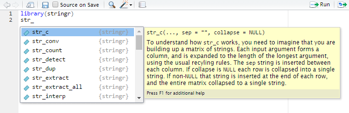

#Introdução: Stringr

Variáveis do tipo texto são muito comuns nos bancos de dados e geralmente são
colunas que dão bastante trabalho para serem manipuladas. É muito comun encontrar
bancos de dados em que os textos de uma coluna não estão padronizados, por exemplo
uma coluna `Estado` em que são encontrados "SP", "sp", "Sao Paulo", "São Paulo", etc
todas as variações indicando o mesmo estado.

Para manipular esses textos o R possui diversas funções para manipular textos, no entanto,
as funções do `base` não possuem um interface consistente e parece que cada uma 
tem a sua forma de passar os parâmetros, dificultando o processo durante a análise.

Por isso, é recomendado usar o pacote `stringr` que possui a sintaxe consistente 
permitindo que o usuário realize qualquer manipulação com textos com maior facilidade.

## Vantagens do stringr em relação ao base

- Sintaxe unificada, o que auxilia na memorização e leitura do código.
- Todas as funções são vetorizadas.
- Construído sobre a [biblioteca ICU](http://site.icu-project.org/), implementada em `C` e `C++`, apresentando resultados rápidos e confiáveis.

## Regras básicas do pacote

- As funções de manipulação de texto começam com `str_`. Caso esqueça o nome de uma função, basta digitar `stringr::str_` e apertar `TAB` para ver quais são as opções.
- O primeiro argumento da função é sempre uma `string` ou um vetor de `strings`.

## Curiosidade

Inicialmente, o `stringr` era um *wrapper* de funções do `base`. Depois disso, 
surgiu um novo pacote `stringi`, com sintaxe similar ao `stringr`, mas funcionando como 
*wrapper* da biblioteca ICU. No entanto, Wickham gostou tanto do pacote `stringi` 
que decidiu reescrever o `stringr` como um *wrapper* do `stringi`. 
Veja [essa página](https://github.com/tidyverse/stringr/blob/master/NEWS.md) para detalhes.
#stringr: Básico
#### str_to_upper, str_to_lower, str_to_title
#str_to_title(s)

Todas as funções do `stringr` começam com o prefixo `str`, isso ajuda na hora de 
encontrar a função que você está procurando. No Rstudio, basta digitar `str_` e
apertar tab que você verá algo parecido com a imagem a baixo. Você pode ir descendo
com as setas do teclado e ver o que cada função faz até encontrar a função que estava
procurando.



Nesta sessão vamos utilizar as funções mais simples do `stringr`, depois vamos
ensinar um pouco de Regex e em seguida veremos as funções mais avançadas do 
pacote.

## Funções básicas

### str_length

A função mais simples do `stringr` é a função `str_length`. Esta função recebe 
apenas uma string como argumento e retorna o número de caracteres. Por exemplo:

```{r}
library(stringr)
str_length("olá")
length("olá")
```

Veja `str_length` é diferente de `length`. O primeiro retorna o número de caracteres
e o segundo retorna o comprimento do objeto. Isso fica mais claro no seguinte exemplo:

```{r}
s <- c("olá mundo", "olá universo")
str_length(s)
length(s)
```

Agora o `str_length` retornou um vetor com o número de caracteres de cada elemento do vetor `s`, 
e o `length` retornou o comprimento do vetor `s`. Note que espaço é considerado como um caractere. 

### str_trim

É muito comum encontrar textos que vêm com espaços a mais, principalmente de dados
provenientes de formulários em que cada usuário escreve da forma que prefere. 

```{r}
string <- '\nessa      string é muito suja       \n'
str_trim(string)
```

A função `str_trim` ajuda removendo os espaços excedetes antes e depois da string.

### str_sub

As vezes você precisa obter alguma parte fixa de uma string. Por exemplo, as vezes você 
encontra variáveis com valores da forma:

```{r}
s <- c("01-Feminino", "02-Masculino", "03-Indefinido")
```

Você pode querer manipular essa string para retirar obter apenas a parte final da string.
Neste caso pode usar a função `str_sub`

```{r}
str_sub(s, start = 4) # pegar do quarto até o último caractere
```

É possível obter também apenas os números

```{r}
str_sub(s, end = 2) # pegar apenas os dois primeiros caracteres
```

Em outros casos você precisa obter os últimos 2 caracteres.

```{r}
s <- c("Feminino-01", "Masculino-02", "Indefinido-03")
str_sub(s, end = -4)
str_sub(s, start = -2)
```

É possível também usar os argumentos `start` e `end` conjuntamente.

```{r}
s <- c("__SP__", "__MG__", "__RJ__")
str_sub(s, 3, 4)
```

### str_to_upper, str_to_lower, str_to_title

Essas funções servem para modificar a caixa das letras. Por exemplo:

```{r}
s <- "Olá, tudo bem?"
str_to_lower(s)
str_to_upper(s)
str_to_title(s)
```

Essas são as funções mais simples do pacote `stringr` e mão exigem nenhum conhecimento
de regex. Note que nenhuma delas possui o parâmetro `pattern`, você verá como especificar
esse parâmetros nas próximas sessões.


#Regex

Trabalhar com textos exige um certo conhecimento de expressões regulares (*regex*).
[Expressões regulares](https://pt.wikipedia.org/wiki/Express%C3%A3o_regular) permitem
identificar conjuntos de caracters, palavras, e outros padrões por meio de uma sintaxe
concisa. 

O `stringr` utiliza regex da forma descrita [neste documento](http://www.gagolewski.com/software/stringi/manual/?manpage=stringi-search-regex). 
A própria [definição](https://stat.ethz.ch/R-manual/R-devel/library/base/html/regex.html) de 
regex do R é um ótimo manual.

## Expressões regulares

Expressão regular ou *regex* é uma sequência concisa de caracteres que representa 
várias strings. Entender o básico de expressões regulares é indispensável para 
trabalhar com textos.

Vamos estudar expressões regulares através de exemplos e com a função `str_detect()`. 
Essa função retorna `TRUE` se uma string atende à uma expressão regular e `FALSE` 
em caso contrário.

Por exemplo:

```{r}
library(stringr)
str_detect("sao paulo", pattern = "paulo$")
str_detect("sao paulo sp", pattern = "paulo$")
```

A regex/pattern "paulo$" indica que o texto deve ser terminado em "paulo". Existem 
diversos de caracteres auxiliares que vão auxiliar na manipulação dos textos, assim como
o "$" neste caso. É importante notar que sempre que você estiver passando algum
valor para o argumento `pattern` de qualquer função do `stringr` ele o entenderá
como uma regex. 

A tabela abaixo mostra a aplicação de seis `regex` a seis strings distintas.

```{r}
testes <- c('ban', 'banana', 'abandonado', 'pranab anderson', 'BANANA', 
            'ele levou ban')

expressoes <- list(
  'ban', # reconhece tudo que tenha "ban", mas não ignora case
  'BAN', # reconhece tudo que tenha "BAN", mas não ignora case
  regex('ban', ignore_case = TRUE), # reconhece tudo que tenha "ban", ignorando case
  'ban$', # reconhece apenas o que termina exatamente em "ban"
  '^ban', # reconhece apenas o que começa exatamente com "ban"
  'b ?an' # reconhece tudo que tenha "ban", com ou sem espaço entre o "b" e o "a"
)
```

```{r echo=FALSE, include=FALSE}
library(purrr)
library(dplyr)
library(tidyr)
list(testes = testes, expressoes = expressoes) %>%
  cross_d() %>%
  distinct() %>%
  mutate(detect = str_detect(testes, expressoes)) %>%
  spread(expressoes, detect) %>%
  DT::datatable()
```

## Quantificadores

Os caracteres `+`, `*` e `{x,y}` indicam quantas vezes um padrão se repete:

- `ey+` significa `e` e depois `y` "**uma vez** ou mais". Por exemplo, reconhece `hey`, `heyy`, `a eyyy`, mas não reconhece `e`, `y` nem `yy`.
- `ey*` significa "**zero vezes** ou mais". Por exemplo, reconhece `hey`, `heyy`, `a eyyy` e `e`, mas não reconhece `y` nem `yy`.
- `ey{3}` significa "exatamente três vezes". Por exemplo, reconhece `eyyy` e `eyyyy`, mas não reconhece `eyy`.
- `ey{1,3}` significa "entre uma e três vezes".

Para aplicar um quantificador a um conjunto de caracteres, use parênteses. Por exemplo, `(ey )+` reconhece `ey ey `.

## Conjuntos

Colocando caracteres dentro de `[]`, reconhecemos quaisquer caracteres desse conjunto. Alguns exemplos práticos:

- `[Cc]asa` para reconhecer "casa" em maiúsculo ou minúsculo.
- `[0-9]` para reconhecer somente números. O mesmo vale para letras `[a-z]`, `[A-Z]`, `[a-zA-Z]` etc.
- O símbolo `^` dentro do colchete significa negação. Por exemplo, `[^0-9]` significa pegar tudo o que não é número.
- O símbolo `.` fora do colchete indica "qualquer caractere", mas dentro do colchete é apenas ponto.
- Use `[[:space:]]+` para reconhecer espaços e `[[:punct:]]+` para reconhecer pontuações.

## Miscelânea

- Use `abjutils::rm_accent()` para retirar os acentos de um texto.
- Use `|` para opções, por exemplo `desfavor|desprov` reconhece tanto "desfavorável" quanto "desprovido"
- `\n` pula linha, `\f` é final da página, `\t` é tab. Use `\` para transformar caracteres especiais em literais.
- `tolower()` e `toupper()` para mudar o case de uma string. 

A lista de possibilidades com expressões regulares é extensa. 
Um bom lugar para testar o funcionamento de expressões regulares é o [regex101](https://regex101.com/).
#stringr: Avançado

Agora que já vimos as funções básicas do `stringr`, e aprendemos um pouco de regex,
vamos às funções mais avançadas. Basicmante, essas funções buscarão `patterns` em
um vetor de strings e farão alguma coisa quando encontrá-lo.

Como já vimos na sessão sobre regex, a função mais simples que possui o argumento
`pattern` é a `str_detect`.

### str_detect()` 

Retorna `TRUE` se a regex é compatível com a string e `FALSE` caso contrário.

```{r}
library(stringr)
str_detect("sao paulo", pattern = "paulo$")
str_detect("sao paulo sp", pattern = "paulo$")
```

### str_replace() e str_replace_all() 

Substituem um padrão (ou todos) encontrado para um outro padrão

```{r}
frutas <- c("uma maçã", "duas pêras", "três bananas")
str_replace(frutas, "[aeiou]", "-") # substitui a primeira vogal de cada string por "-"
str_replace_all(frutas, "[aeiou]", "-") # substitui todas as vogais por "-"

yyyy <- "yyyyy yyyyy ll zz"
str_replace(yyyy, 'y+', 'x') # substitui o primeiro 1 ou mais y's por x
str_replace_all(yyyy, 'y+', 'x') # substitui todos os 1 ou mais y por somente 1 x
str_replace_all(yyyy, 'y', 'x') # substitui y por x

str_replace_all('string     com    muitos espaços', ' +', ' ') # tirar espaços extras
```

Muitas vezes queremos remover alguns caracteres especiais de um texto, mas esses 
caracteres fazem parte de comandos de regex, por exemplo:

```{r}
string <- "1 + 2 + 5"
#str_replace_all(string, "+", "-")
```

Essa forma retorna um erro, pois a função tenta montar uma regex. Você poderia 
tentar de outras formas, que não retornariam erro, mas também não retornariam o 
resultado esperado.

```{r}
str_replace_all(string, " + ", " - ")
```

Nesse caso, use a função `fixed` para indicar para o `stringr` que você não deseja
que o parâmetro seja reconhecido como uma regex.

```{r}
str_replace_all(string, fixed("+"), "-")
```

### str_match() e str_match_all() 

Extrai pedaços da string identificados pela regex. Caso queira extrair somente a 
parte identificada, use parênteses.

```{r}
frases <- c('a roupa do rei', 'de roma', 'o rato roeu')
str_match(frases, 'roe')
str_match_all(frases, 'ro')
str_match(frases, 'o (ro)')
```

### str_split() e str_split_fixed()

Separa uma string em várias de acordo com um separador.

```{r}
string <- 'eu sei, usar virgulas, de forma, perfeita'

str_split(string, ', ')
str_split(string, ', ', simplify = TRUE)
```

Faz o mesmo que `str_split()`, mas separa apenas `n` vezes

```{r}
str_split_fixed(string, ', ', 3)
str_split_fixed(string, ', ', 4) # igual a str_split(string, simplify = TRUE)
```

### str_subset() 

Retorna somente as strings compatíveis com a regex.

```{r}
frases <- c('a roupa do rei', 'de roma', 'o rato roeu')
str_subset(frases, 'd[eo]')
```

É o mesmo que fazer o subset do R e a função `str_detect`.

```{r}
frases[str_detect(frases, "d[eo]")]
```

#Untitled

### Exercícios

1. Considere o seguinte texto

```{r}
txt <- "A função mais importante para leitura de dados no `lubridate` é a `ymd`. Essa função serve para ler qualquer data de uma `string` no formato `YYYY-MM-DD`. Essa função é útil pois funciona com qualquer separador entre os elementos da data e também porque temos uma função para cada formato (`mdy`, `dmy`, `dym`, `myd`, `ydm`)."
```

Extraia todas as combinações da função `ymd`, sem repetições.

2. Considere os textos abaixo

```{r}
txts <- c(
  'o produto é muito bom',
  'o produto não é bom',
  'o produto não é muito bom',
  'o produto não é ruim',
  'o produto não é não bom'
)
```

Crie uma regra para identificar se o texto refere-se a um feedback positivo ou negativo sobre o produto (considera não bom = ruim e vice-versa). Retorne um vetor lógico que vale `TRUE` se o feedback é positivo e `FALSE` caso contrário.
#'index'
##### str_to_upper, str_to_lower, str_to_title
##str_to_title(s)
#### str_to_upper, str_to_lower, str_to_title
#str_to_title(s)
##Untitled
#Introdução: Stringr

Variáveis do tipo texto são muito comuns nos bancos de dados e geralmente são
colunas que dão bastante trabalho para serem manipuladas. É muito comun encontrar
bancos de dados em que os textos de uma coluna não estão padronizados, por exemplo
uma coluna `Estado` em que são encontrados "SP", "sp", "Sao Paulo", "São Paulo", etc
todas as variações indicando o mesmo estado.

Para manipular esses textos o R possui diversas funções para manipular textos, no entanto,
as funções do `base` não possuem um interface consistente e parece que cada uma 
tem a sua forma de passar os parâmetros, dificultando o processo durante a análise.

Por isso, é recomendado usar o pacote `stringr` que possui a sintaxe consistente 
permitindo que o usuário realize qualquer manipulação com textos com maior facilidade.

## Vantagens do stringr em relação ao base

- Sintaxe unificada, o que auxilia na memorização e leitura do código.
- Todas as funções são vetorizadas.
- Construído sobre a [biblioteca ICU](http://site.icu-project.org/), implementada em `C` e `C++`, apresentando resultados rápidos e confiáveis.

## Regras básicas do pacote

- As funções de manipulação de texto começam com `str_`. Caso esqueça o nome de uma função, basta digitar `stringr::str_` e apertar `TAB` para ver quais são as opções.
- O primeiro argumento da função é sempre uma `string` ou um vetor de `strings`.

## Curiosidade

Inicialmente, o `stringr` era um *wrapper* de funções do `base`. Depois disso, 
surgiu um novo pacote `stringi`, com sintaxe similar ao `stringr`, mas funcionando como 
*wrapper* da biblioteca ICU. No entanto, Wickham gostou tanto do pacote `stringi` 
que decidiu reescrever o `stringr` como um *wrapper* do `stringi`. 
Veja [essa página](https://github.com/tidyverse/stringr/blob/master/NEWS.md) para detalhes.
#stringr: Básico
#### str_to_upper, str_to_lower, str_to_title
#str_to_title(s)

Todas as funções do `stringr` começam com o prefixo `str`, isso ajuda na hora de 
encontrar a função que você está procurando. No Rstudio, basta digitar `str_` e
apertar tab que você verá algo parecido com a imagem a baixo. Você pode ir descendo
com as setas do teclado e ver o que cada função faz até encontrar a função que estava
procurando.


Nesta sessão vamos utilizar as funções mais simples do `stringr`, depois vamos
ensinar um pouco de Regex e em seguida veremos as funções mais avançadas do 
pacote.

## Funções básicas

### str_length

A função mais simples do `stringr` é a função `str_length`. Esta função recebe 
apenas uma string como argumento e retorna o número de caracteres. Por exemplo:

```{r}
library(stringr)
str_length("olá")
length("olá")
```

Veja `str_length` é diferente de `length`. O primeiro retorna o número de caracteres
e o segundo retorna o comprimento do objeto. Isso fica mais claro no seguinte exemplo:

```{r}
s <- c("olá mundo", "olá universo")
str_length(s)
length(s)
```

Agora o `str_length` retornou um vetor com o número de caracteres de cada elemento do vetor `s`, 
e o `length` retornou o comprimento do vetor `s`. Note que espaço é considerado como um caractere. 

### str_trim

É muito comum encontrar textos que vêm com espaços a mais, principalmente de dados
provenientes de formulários em que cada usuário escreve da forma que prefere. 

```{r}
string <- '\nessa      string é muito suja       \n'
str_trim(string)
```

A função `str_trim` ajuda removendo os espaços excedetes antes e depois da string.

### str_sub

As vezes você precisa obter alguma parte fixa de uma string. Por exemplo, as vezes você 
encontra variáveis com valores da forma:

```{r}
s <- c("01-Feminino", "02-Masculino", "03-Indefinido")
```

Você pode querer manipular essa string para retirar obter apenas a parte final da string.
Neste caso pode usar a função `str_sub`

```{r}
str_sub(s, start = 4) # pegar do quarto até o último caractere
```

É possível obter também apenas os números

```{r}
str_sub(s, end = 2) # pegar apenas os dois primeiros caracteres
```

Em outros casos você precisa obter os últimos 2 caracteres.

```{r}
s <- c("Feminino-01", "Masculino-02", "Indefinido-03")
str_sub(s, end = -4)
str_sub(s, start = -2)
```

É possível também usar os argumentos `start` e `end` conjuntamente.

```{r}
s <- c("__SP__", "__MG__", "__RJ__")
str_sub(s, 3, 4)
```

### str_to_upper, str_to_lower, str_to_title

Essas funções servem para modificar a caixa das letras. Por exemplo:

```{r}
s <- "Olá, tudo bem?"
str_to_lower(s)
str_to_upper(s)
str_to_title(s)
```

Essas são as funções mais simples do pacote `stringr` e mão exigem nenhum conhecimento
de regex. Note que nenhuma delas possui o parâmetro `pattern`, você verá como especificar
esse parâmetros nas próximas sessões.


#Regex

Trabalhar com textos exige um certo conhecimento de expressões regulares (*regex*).
[Expressões regulares](https://pt.wikipedia.org/wiki/Express%C3%A3o_regular) permitem
identificar conjuntos de caracters, palavras, e outros padrões por meio de uma sintaxe
concisa. 

O `stringr` utiliza regex da forma descrita [neste documento](http://www.gagolewski.com/software/stringi/manual/?manpage=stringi-search-regex). 
A própria [definição](https://stat.ethz.ch/R-manual/R-devel/library/base/html/regex.html) de 
regex do R é um ótimo manual.

## Expressões regulares

Expressão regular ou *regex* é uma sequência concisa de caracteres que representa 
várias strings. Entender o básico de expressões regulares é indispensável para 
trabalhar com textos.

Vamos estudar expressões regulares através de exemplos e com a função `str_detect()`. 
Essa função retorna `TRUE` se uma string atende à uma expressão regular e `FALSE` 
em caso contrário.

Por exemplo:

```{r}
library(stringr)
str_detect("sao paulo", pattern = "paulo$")
str_detect("sao paulo sp", pattern = "paulo$")
```

A regex/pattern "paulo$" indica que o texto deve ser terminado em "paulo". Existem 
diversos de caracteres auxiliares que vão auxiliar na manipulação dos textos, assim como
o "$" neste caso. É importante notar que sempre que você estiver passando algum
valor para o argumento `pattern` de qualquer função do `stringr` ele o entenderá
como uma regex. 

A tabela abaixo mostra a aplicação de seis `regex` a seis strings distintas.

```{r}
testes <- c('ban', 'banana', 'abandonado', 'pranab anderson', 'BANANA', 
            'ele levou ban')

expressoes <- list(
  'ban', # reconhece tudo que tenha "ban", mas não ignora case
  'BAN', # reconhece tudo que tenha "BAN", mas não ignora case
  regex('ban', ignore_case = TRUE), # reconhece tudo que tenha "ban", ignorando case
  'ban$', # reconhece apenas o que termina exatamente em "ban"
  '^ban', # reconhece apenas o que começa exatamente com "ban"
  'b ?an' # reconhece tudo que tenha "ban", com ou sem espaço entre o "b" e o "a"
)
```

```{r echo=FALSE, include=FALSE}
library(purrr)
library(dplyr)
library(tidyr)
list(testes = testes, expressoes = expressoes) %>%
  cross_d() %>%
  distinct() %>%
  mutate(detect = str_detect(testes, expressoes)) %>%
  spread(expressoes, detect) %>%
  DT::datatable()
```

## Quantificadores

Os caracteres `+`, `*` e `{x,y}` indicam quantas vezes um padrão se repete:

- `ey+` significa `e` e depois `y` "**uma vez** ou mais". Por exemplo, reconhece `hey`, `heyy`, `a eyyy`, mas não reconhece `e`, `y` nem `yy`.
- `ey*` significa "**zero vezes** ou mais". Por exemplo, reconhece `hey`, `heyy`, `a eyyy` e `e`, mas não reconhece `y` nem `yy`.
- `ey{3}` significa "exatamente três vezes". Por exemplo, reconhece `eyyy` e `eyyyy`, mas não reconhece `eyy`.
- `ey{1,3}` significa "entre uma e três vezes".

Para aplicar um quantificador a um conjunto de caracteres, use parênteses. Por exemplo, `(ey )+` reconhece `ey ey `.

## Conjuntos

Colocando caracteres dentro de `[]`, reconhecemos quaisquer caracteres desse conjunto. Alguns exemplos práticos:

- `[Cc]asa` para reconhecer "casa" em maiúsculo ou minúsculo.
- `[0-9]` para reconhecer somente números. O mesmo vale para letras `[a-z]`, `[A-Z]`, `[a-zA-Z]` etc.
- O símbolo `^` dentro do colchete significa negação. Por exemplo, `[^0-9]` significa pegar tudo o que não é número.
- O símbolo `.` fora do colchete indica "qualquer caractere", mas dentro do colchete é apenas ponto.
- Use `[[:space:]]+` para reconhecer espaços e `[[:punct:]]+` para reconhecer pontuações.

## Miscelânea

- Use `abjutils::rm_accent()` para retirar os acentos de um texto.
- Use `|` para opções, por exemplo `desfavor|desprov` reconhece tanto "desfavorável" quanto "desprovido"
- `\n` pula linha, `\f` é final da página, `\t` é tab. Use `\` para transformar caracteres especiais em literais.
- `tolower()` e `toupper()` para mudar o case de uma string. 

A lista de possibilidades com expressões regulares é extensa. 
Um bom lugar para testar o funcionamento de expressões regulares é o [regex101](https://regex101.com/).
#stringr: Avançado

Agora que já vimos as funções básicas do `stringr`, e aprendemos um pouco de regex,
vamos às funções mais avançadas. Basicmante, essas funções buscarão `patterns` em
um vetor de strings e farão alguma coisa quando encontrá-lo.

Como já vimos na sessão sobre regex, a função mais simples que possui o argumento
`pattern` é a `str_detect`.

### str_detect()` 

Retorna `TRUE` se a regex é compatível com a string e `FALSE` caso contrário.

```{r}
library(stringr)
str_detect("sao paulo", pattern = "paulo$")
str_detect("sao paulo sp", pattern = "paulo$")
```

### str_replace() e str_replace_all() 

Substituem um padrão (ou todos) encontrado para um outro padrão

```{r}
frutas <- c("uma maçã", "duas pêras", "três bananas")
str_replace(frutas, "[aeiou]", "-") # substitui a primeira vogal de cada string por "-"
str_replace_all(frutas, "[aeiou]", "-") # substitui todas as vogais por "-"

yyyy <- "yyyyy yyyyy ll zz"
str_replace(yyyy, 'y+', 'x') # substitui o primeiro 1 ou mais y's por x
str_replace_all(yyyy, 'y+', 'x') # substitui todos os 1 ou mais y por somente 1 x
str_replace_all(yyyy, 'y', 'x') # substitui y por x

str_replace_all('string     com    muitos espaços', ' +', ' ') # tirar espaços extras
```

Muitas vezes queremos remover alguns caracteres especiais de um texto, mas esses 
caracteres fazem parte de comandos de regex, por exemplo:

```{r}
string <- "1 + 2 + 5"
#str_replace_all(string, "+", "-")
```

Essa forma retorna um erro, pois a função tenta montar uma regex. Você poderia 
tentar de outras formas, que não retornariam erro, mas também não retornariam o 
resultado esperado.

```{r}
str_replace_all(string, " + ", " - ")
```

Nesse caso, use a função `fixed` para indicar para o `stringr` que você não deseja
que o parâmetro seja reconhecido como uma regex.

```{r}
str_replace_all(string, fixed("+"), "-")
```

### str_match() e str_match_all() 

Extrai pedaços da string identificados pela regex. Caso queira extrair somente a 
parte identificada, use parênteses.

```{r}
frases <- c('a roupa do rei', 'de roma', 'o rato roeu')
str_match(frases, 'roe')
str_match_all(frases, 'ro')
str_match(frases, 'o (ro)')
```

### str_split() e str_split_fixed()

Separa uma string em várias de acordo com um separador.

```{r}
string <- 'eu sei, usar virgulas, de forma, perfeita'

str_split(string, ', ')
str_split(string, ', ', simplify = TRUE)
```

Faz o mesmo que `str_split()`, mas separa apenas `n` vezes

```{r}
str_split_fixed(string, ', ', 3)
str_split_fixed(string, ', ', 4) # igual a str_split(string, simplify = TRUE)
```

### str_subset() 

Retorna somente as strings compatíveis com a regex.

```{r}
frases <- c('a roupa do rei', 'de roma', 'o rato roeu')
str_subset(frases, 'd[eo]')
```

É o mesmo que fazer o subset do R e a função `str_detect`.

```{r}
frases[str_detect(frases, "d[eo]")]
```

#Untitled

### Exercícios

1. Considere o seguinte texto

```{r}
txt <- "A função mais importante para leitura de dados no `lubridate` é a `ymd`. Essa função serve para ler qualquer data de uma `string` no formato `YYYY-MM-DD`. Essa função é útil pois funciona com qualquer separador entre os elementos da data e também porque temos uma função para cada formato (`mdy`, `dmy`, `dym`, `myd`, `ydm`)."
```

Extraia todas as combinações da função `ymd`, sem repetições.

2. Considere os textos abaixo

```{r}
txts <- c(
  'o produto é muito bom',
  'o produto não é bom',
  'o produto não é muito bom',
  'o produto não é ruim',
  'o produto não é não bom'
)
```

Crie uma regra para identificar se o texto refere-se a um feedback positivo ou negativo sobre o produto (considera não bom = ruim e vice-versa). Retorne um vetor lógico que vale `TRUE` se o feedback é positivo e `FALSE` caso contrário.
